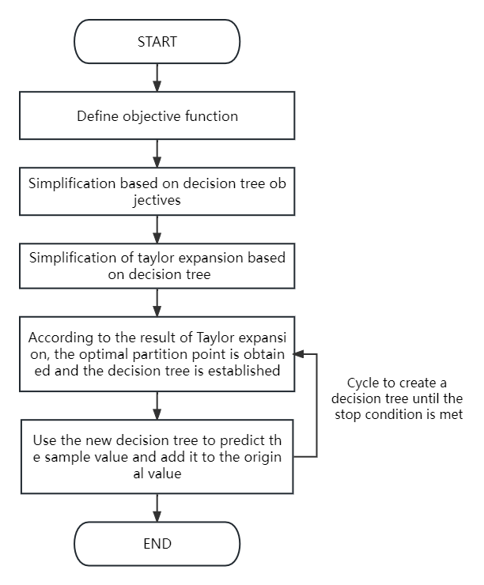

# On the Training and Result Analysis of the Classification Algorithm XGBoost

## Abstract
This paper explores the XGBoost and Gradient Boosting Decision Tree (GBDT) algorithms for analyzing COVID datasets. Our study aims to compare these two widely used techniques in machine learning and their effectiveness in different aspects such as performance, accuracy, precision, and model training time.

### Authors
- Yi-Chun Huang
- 36282705
- 36202620
- 36347797

## Introduction
The paper begins with an exploration of tree methods and boosting techniques. We delve into the mathematical principles of XGBoost, its implementation, and a comparative analysis with the GBDT algorithm. The focus is on understanding the advantages, disadvantages, and applicability of these methods in various scenarios.

## Methods
We employ both GBDT and XGBoost methods for our analysis. The paper discusses various aspects of these methods, including their mathematical models, objective functions, optimization processes, and implementation details. We use Kaggle's COVID-19 dataset for training and prediction, focusing on various performance metrics.

## Experiment/Results
Our results indicate differences in performance between GBDT and XGBoost in terms of accuracy, recall, precision, F1 score, and training time. The paper provides a detailed discussion of these findings and their implications.

## Discussion
We discuss the learning experience, challenges encountered, and the insights gained from this study. The paper concludes with suggestions for future research directions.

## References
<a id="1">[1]</a> Y.-Y. Song and L. Ying, “Decision tree methods: applications for classification and prediction,” Shanghai archives of psychiatry, vol. 27, no. 2, p. 130, 2015.

<a id="1">[2]</a> T. Chen and C. Guestrin, “Xgboost: A scalable tree boosting system,” in Proceedings of the 22nd ACM SIGKDD international conference on knowledge discovery and data mining, no. 5, 2016, pp. 785–794.

<a id="1">[3]</a> W. Liang, S. Luo, G. Zhao, and H. Wu, “Predicting hard rock pillar stability using GBDT, XGBoost, and LightGBM algorithms,” Mathematics, vol. 8, no. 1, p. 765, 2020.

<a id="1">[4]</a> J. Cheng, G. Li, and X. Chen, “Research on travel time prediction model of freeway based on gradient boosting decision tree,” IEEE Access, vol. 7, no. 2, pp. 7466–7480, 2018.

<a id="1">[5]</a> T. Chen, T. He, M. Benesty, V. Khotilovich, Y. Tang, H. Cho, K. Chen et al., “XGBoost: extreme gradient boosting,” R package version 0.4-2, vol. 1, no. 3, pp. 1–4, 2015.

<a id="1">[6]</a> B. Li, J. Friedman, R. Olshen, and C. Stone, “Classification and regression trees (CART),” Biometrics, vol. 40, no. 4, pp. 358–361, 1984.

<a id="1">[7]</a> D. Geling and D. Geling, “Detailed explanation of CSP-J2019 simulation certification test 2,” Fujian Computer, vol. 35, no. 6, p. 6, 2019.

<a id="1">[8]</a> S. S. Dhaliwal, A.-A. Nahid, and R. Abbas, “Effective intrusion detection system using XGBoost,” Information, vol. 9, no. 7, p. 149, 2018.
